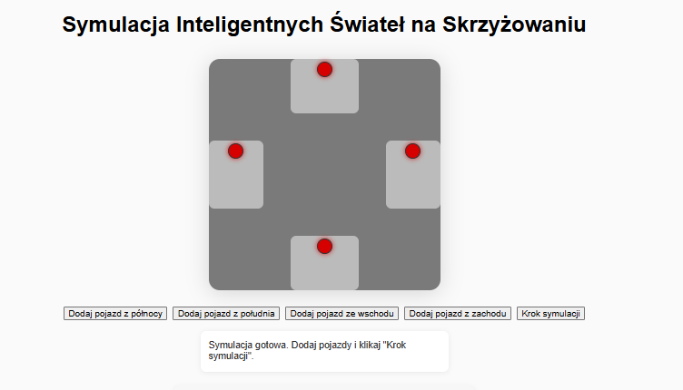

## Wstęp

Projekt przedstawia inteligentny system sterowania ruchem na czterokierunkowym skrzyżowaniu.
Celem zadania jest zaprojektowanie i zaimplementowanie systemu, który dostosowuje cykle świateł w oparciu o natężenie ruchu na poszczególnych drogach.
System zawiera zarówno backendową logikę symulacji, jak i interaktywną wizualizację webową.


## Cel projektu

- **Symulacja rzeczywistego ruchu** na skrzyżowaniu z czterema drogami.
- **Zastosowanie algorytmów inteligentnego sterowania** światłami, eliminujących zbędne opóźnienia.
- **Wizualizacja w czasie rzeczywistym** oraz monitoring kluczowych metryk.


## Zastosowane technologie

- **TypeScript** – logika symulacji, modelowanie obiektów (backend).
- **JavaScript** – logika frontendu i obsługa GUI.
- **HTML5 + CSS3** –   interfejs użytkownika.
- **Node.js + Express** – serwer do lokalnego uruchamiania aplikacji webowej.
- **Jest** – testy jednostkowe pod kątem logiki.


## Architektura projektu

```
symulacjav2/
│
├── src/
│   ├── models/
│   │   ├── Intersection.ts   # Główna logika skrzyżowania i świateł
│   │   ├── Vehicle.ts        # Model pojazdu
│   │   └── TrafficLight.ts   # Model świateł
│   └── main.ts               # Obsługa symulacji (CLI/JSON)
│
├── metrics.js                # Moduł metryk i monitoringu (frontend)
├── main.js                   # Logika frontendu (wizualizacja, sterowanie)
├── index.html                # Interfejs użytkownika (GUI)
├── style.css                 # Stylowanie GUI
├── server.js                 # Serwer Express (Node.js)
├── README.md                 # Dokumentacja
└── tests/
    └── Intersection.test.ts  # Testy jednostkowe
```


## Opis algorytmu

### Założenia systemu
- Skrzyżowanie posiada 4 drogi: `north`, `south`, `east`, `west`.
- Każda droga ma własną kolejkę pojazdów.
- W każdym kroku zielone światło otrzymuje para niekolidujących dróg (`north+south` lub `east+west`).

### Logika inteligentnych świateł
1. **Wybór pary zielonych świateł:**
   - Para z większą liczbą oczekujących pojazdów otrzymuje zielone światło.
   - Przy remisie pary przełączają się naprzemiennie.
2. **Przepuszczanie pojazdów:**
   - W jednym kroku przejeżdża maksymalnie 1 pojazd z każdej zielonej drogi.
3. **Brak sztucznego opóźnienia:**
   - Jeśli na zielonej parze nie ma pojazdów, światła natychmiast przełączają się na drugą parę.
   - Nie występuje wymuszony etap „wszystkie czerwone”.
4. **Adaptacyjność:**
   - System dynamicznie reaguje na zmiany natężenia ruchu.


## Metryki i monitoring

W systemie zaimplementowano kompleksowy monitoring:
- **Łączna liczba przetworzonych pojazdów**
- **Średni czas oczekiwania pojazdu**
- **Przepustowość (pojazdy/krok)**
- **Efektywność systemu (% kroków z ruchem)**
- Wyniki prezentowane są w panelu pod GUI.


## Konteneryzacja (Docker)

Aplikacja może być uruchomiona w kontenerze Dockerze.

### Pliki:
- **Dockerfile** – definiuje środowisko Node.js, instaluje zależności i uruchamia serwer Express na porcie 3000.
- **.dockerignore** – wyklucza z obrazu zbędne pliki (np. node_modules, .git, logi).

### Instrukcja

1. Zbuduj obraz Dockera:
   ```bash
   docker build -t symulacjav2 .
   ```
2. Uruchom kontener:
   ```bash
   docker run -p 3000:3000 symulacjav2
   ```
3. Otwórz aplikację w przeglądarce: [http://localhost:3000](http://localhost:3000)


## Testowanie
Testy jednostkowe (Jest) pokrywają kluczowe przypadki:
- Dodawanie pojazdów do kolejek.
- Poprawność przepuszczania pojazdów przez skrzyżowanie.
- Naprzemienne przełączanie par świateł.
- Brak sztucznego opóźnienia.


Uruchom testy:
```bash
npm test
```


## Przykłady działania


- **Dodanie pojazdów:**  
  Kliknij odpowiedni przycisk, pojazd pojawi się na drodze.
- **Krok symulacji:**  
  Pojazdy przejeżdżają zgodnie z logiką świateł, metryki aktualizują się na bieżąco.
- **Panel metryk:**  
  Pod GUI wyświetlane są aktualne statystyki systemu.


## Podsumowanie i wnioski

Projekt pokazuje, jak w praktyce zaimplementować inteligentny system sterowania ruchem drogowym, który:
- Maksymalizuje przepustowość skrzyżowania.
- Minimalizuje czas oczekiwania pojazdów.
- Jest łatwy do rozbudowy (np. o priorytet pojazdów, tj. policja, straż pożarna na sygnale).
- Posiada przejrzystą, nowoczesną dokumentację i czytelny kod.


---

**Autor:**  
Karol Dzierżak
2025


